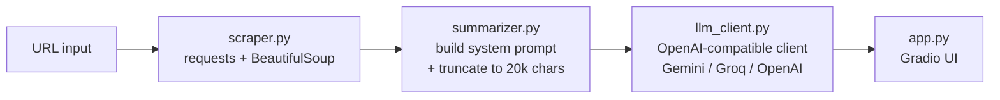

# Website Summarizer

A small Gradio app that takes a URL, scrapes the page, and asks an LLM to summarize it
in one of a few selectable "personalities" (friendly, snarky, explain-like-I'm-10, or an
executive bullet brief). The LLM provider (Gemini, Groq, or OpenAI) is swappable at
runtime via a single environment variable — the app code never changes when you switch
providers, because every provider is called through the OpenAI-compatible chat
completions API.

## Architecture



## Setup and run

```bash
cd 01-website-summarizer
python -m venv .venv
source .venv/bin/activate        # Windows: .venv\Scripts\activate

pip install -r requirements.txt

cp .env.example .env
# edit .env: set LLM_PROVIDER and the API key for that provider

python app.py
```

Gradio will print a local URL (and, if you add `share=True` in `app.py`, a temporary
public one).

## Switching providers

Set `LLM_PROVIDER` in `.env` to `gemini`, `groq`, or `openai`, and make sure the matching
API key (`GEMINI_API_KEY`, `GROQ_API_KEY`, or `OPENAI_API_KEY`) is set. Each provider has
a sane default model baked into `llm_client.py`; override it per-provider with the
optional `LLM_MODEL` variable if you want a different one.

## Design decisions and trade-offs

- **Provider abstraction via the OpenAI client, not a custom wrapper.** Gemini, Groq, and
  OpenAI all expose an OpenAI-compatible `chat.completions` endpoint, so `llm_client.py`
  just swaps `base_url` and `api_key` per provider instead of writing and maintaining
  three different SDK integrations.
- **Truncation over chunking.** The scraped page text is hard-capped at 20,000 characters
  before it's sent to the model. This is simpler and cheaper than map-reduce chunking,
  at the cost of dropping content on long pages — an acceptable trade-off for a
  single-pass summarizer, but the first thing to revisit if long-document fidelity
  matters.
- **Keys only in `.env`.** No credentials are hardcoded or passed as CLI args; `.env` is
  gitignored and `.env.example` documents the expected shape with placeholder values.

## Known limitations

- **JavaScript-rendered pages return little or no text.** The scraper does a plain HTTP
  GET and parses static HTML with BeautifulSoup — it doesn't execute JS, so SPA-style
  sites can yield near-empty content.
- **Long pages lose content to truncation.** Anything past the 20,000-character cap is
  silently dropped rather than summarized in parts.

## Roadmap

- Map-reduce chunking for long pages (summarize chunks, then summarize the summaries)
  instead of hard truncation.
- Cache summaries by URL to avoid redundant scrapes/LLM calls.
- Retries with backoff on transient API/network errors, including rate limits.
- Token and cost logging per request.
- A small eval set (known pages + expected summary qualities) to catch regressions when
  prompts or providers change.
- Containerize with Docker and deploy to Hugging Face Spaces.
