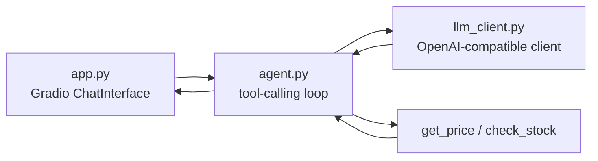
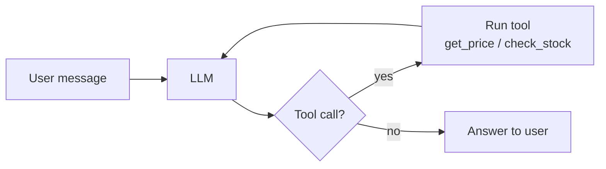

# Shop Agent

A small Gradio chat app where an LLM acts as a shop assistant, deciding **on its own**
whether a question needs a tool call (price lookup, stock check) before it answers. It
also includes a second, simpler script (`summarizer_langchain.py`) that re-implements
project 01's summarizer as a LangChain chain, to show the same provider config used two
different ways.

## Why this is an agent, not a pipeline

Project 01 (`llm-pipeline-website-summarizer`) is a **pipeline**: scrape → build prompt → call LLM →
show result. The steps and their order are fixed in code; the LLM only ever fills in the
last blank.

This project is an **agent**: the LLM itself decides, per message, whether it needs to
call a tool, which tool, with what arguments, and whether the result is enough to answer
or another tool call is needed. The code doesn't know in advance whether "How much are
the shoes, and is the hat in stock?" needs zero, one, or two tool calls — the model works
that out at runtime, and `agent.py` just keeps running the loop until the model says it's
done (or `MAX_STEPS` is hit).

## Architecture



`app.py` owns the UI and chat history; it just calls `agent()` with the new message and
the history so far. `agent.py` owns the loop and the tool registry; it calls out to
`llm_client.py` for the model and to the tool functions directly. No component reaches
past the one next to it — `app.py` never calls a tool or the LLM client directly.

## The loop



Each pass through the loop sends the full conversation (system prompt + history + any
tool results so far) back to the model. The model either returns a tool call, which
`agent.py` executes and feeds back in, or returns a final answer, which ends the loop.

## Setup and run

```bash
# from the repo root (shared venv and .env — see the root README)
python3 -m venv .venv
source .venv/bin/activate        # Windows: .venv\Scripts\activate
pip install -r 02-agent-shop-assistant/requirements.txt

cp 02-agent-shop-assistant/.env.example .env    # skip if you already have a root .env
# edit .env: set LLM_PROVIDER and the API key for that provider

cd 02-agent-shop-assistant
python app.py
```

Gradio prints a local URL. Watch the terminal while you chat — each tool call prints a
`🔧 tool called: ...` line so you can see the agent deciding to use a tool in real time.

To run the LangChain summarizer chain standalone instead:

```bash
python summarizer_langchain.py
```

## Try it

The catalog (`PRICES` / `STOCK` in `agent.py`) has: shoes (₹799, 12 in stock), hat (₹399,
out of stock), bag (₹1420, 5 in stock), shorts (₹1299, 3 in stock), pants (₹1699, out of
stock). Watch the terminal while you chat — each tool call prints
`🔧 tool called: get_price(...)` or `🔧 tool called: check_stock(...)` the instant the
model decides to use it.

| Ask | What happens |
|-----|--------------|
| "Hi! What can you help with?" | No tool call — small talk is answered directly from the system prompt. |
| "How much are the shoes?" | One `get_price("shoes")` call → answers ₹799. |
| "Is the hat in stock?" | One `check_stock("hat")` call → answers out of stock. |
| "What's the price of the bag, and is it in stock?" | Two tool calls in the same turn — `get_price("bag")` and `check_stock("bag")` — before answering ₹1420, 5 left. |
| "Is the hat in stock? If not, what about the bag?" | Two *sequential* rounds — `check_stock("hat")` comes back empty, which is what makes the model call `check_stock("bag")` next. This is the case a single-pass (call-model-once) version can't handle. |
| "How much are the earrings?" | `get_price("earrings")` is still called, returns "unknown item" (not in the dict), and the model relays that rather than guessing a price. |

## Design decisions

- **A multi-step loop with a `MAX_STEPS` guard, not a single pass.** A typical course
  example calls the model once, runs at most one tool, and calls the model a second time
  to get the answer. That breaks on compound questions ("price of the shoes *and* stock
  on the hat") that need more than one round of tool calls. `agent.py` instead loops,
  feeding tool results back in, until the model stops asking for tools — capped at
  `MAX_STEPS = 5` so a confused model can't loop forever and run up API costs.
- **A tool registry instead of if/elif branching.** `TOOL_REGISTRY` maps a tool name to
  its Python function; `TOOLS` holds the matching spec the model reads to decide when to
  call it. Adding a tool is one line in each dict — no changes to the loop itself.
- **Memory by re-sending history, not a stateful session.** `app.py` passes Gradio's
  chat history into `agent()` on every call, which prepends it to the message list sent
  to the model. This keeps the agent function itself stateless and easy to test in
  isolation (see the `__main__` block in `agent.py`), at the cost of resending the full
  history on every turn.
- **Tool results aren't kept in the history Gradio stores** — only the user/assistant
  text turns are. If a user asks "is the hat in stock?" twice in one session, the second
  answer still calls `check_stock` again instead of reusing a stale cached number.
- **Retries with backoff on 503/429, via the client, not custom code.** `llm_client.py`
  sets `max_retries=5` and a `timeout` on the LangChain model rather than hand-rolling a
  retry loop — the SDK already backs off correctly on transient provider errors and rate
  limits.
- **A pinned model version, not a `-latest` alias.** Model IDs in `PROVIDERS` (e.g.
  `gemini-3.8-flash`, `gpt-4o-mini`) are fixed versions. A `-latest` alias can change
  silently underneath you and shift tool-calling behavior or pricing without warning;
  pinning means upgrades are a deliberate, reviewed change.

## Known limitations

- No streaming — the full answer (and any tool calls) is generated before anything is
  shown in the UI.
- `get_price` and `check_stock` read from hardcoded in-memory dicts, not a real
  inventory system.
- No logging of tool calls, token usage, or latency beyond the `print()` in each tool.

## Roadmap

- Model fallback chain (try a backup provider/model on a 503 instead of just retrying
  the same one).
- Streaming responses to the Gradio UI.
- Logging of tool calls and token usage per request, for cost and behavior tracking.
- A small eval set to measure tool-selection accuracy (does the model call the right
  tool, with the right args, and skip tools on small talk) across prompt/model changes.
