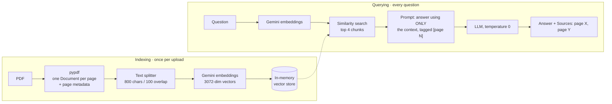

# 03 · RAG PDF Chat

Upload a PDF and ask questions about it. Answers come only from the document, with
page-level citations, in a Gradio chat UI.

**RAG (retrieval-augmented generation)** means the LLM doesn't answer from memory. First
we *retrieve* the few passages of your document most relevant to the question, then the
LLM *generates* an answer grounded in just those passages.

## How it works

RAG has two phases. Indexing runs once per upload and querying runs on every question.



## Files

| File | What it is |
|------|------------|
| `pdf_chat.py` | The app: upload → index → chat, with citations. |
| `rag_basics.py` | Minimal RAG over five hard-coded docs. Shows retrieval working without shared keywords, and "I don't know" when the answer isn't there. |
| `embeddings_demo.py` | Embeds a few sentences and prints cosine similarity, to show that vectors capture meaning. |
| `llm_client.py` | Provider config (Gemini / Groq / OpenAI) for both the chat model and the embeddings. |

## Setup and run

The repo uses one shared virtualenv and one `.env`, both at the repo root.

```bash
# from the repo root
python3 -m venv .venv
source .venv/bin/activate          # Windows: .venv\Scripts\activate
pip install -r 03-rag-pdf-chat/requirements.txt

cp 03-rag-pdf-chat/.env.example .env   # skip if you already have a root .env
# edit .env: set LLM_PROVIDER=gemini and GEMINI_API_KEY

cd 03-rag-pdf-chat
python pdf_chat.py                 # the app
python rag_basics.py               # the minimal walkthrough
python embeddings_demo.py          # the similarity demo
```

Watch the terminal while you chat. Each question prints the retrieved chunks and their
page numbers, so you can see what the model was actually given.

> Embeddings are configured for Gemini (`gemini-embedding-001`). With another provider,
> set `EMBED_MODEL` in `.env`, or `text-embedding-3-small` is used by default.

## Design decisions

**Gemini embeddings instead of a local model.** A local embedding model (e.g.
sentence-transformers) pulls in PyTorch, which is a multi-GB install and slow to start.
An embeddings API keeps the install small and uses the same OpenAI-compatible client and
API key as the chat model. The trade-off is that every chunk costs an API call. That's why
`MAX_PAGES = 60` keeps a single upload within free-tier limits.

**In-memory vector store.** `InMemoryVectorStore` is enough for one user chatting with
one PDF. A brute-force search over a few hundred vectors takes microseconds, and there's
no service to run. I'd move to **Chroma** (embedded, on disk) when the index needs to
survive restarts or be shared across several documents. I'd move to **Qdrant** (a server
with metadata filtering) when there are many users or a corpus too big for one process's
memory.

**Chunk size 800 / overlap 100.** 800 characters is roughly one or two paragraphs. That's
big enough to hold a complete thought, and small enough that the top-4 chunks stay focused
and fit easily in the prompt. The 100-character overlap stops a sentence that falls on a
boundary from being lost to both neighbours. Chunks are split *within* pages, so every
chunk keeps the page number it came from.

**"Use ONLY the context" prompt for grounding.** The prompt tells the model to answer
only from the retrieved passages. When they don't contain the answer, it must reply
exactly *"I couldn't find that in the document."* This turns "the retriever missed" into
a visible, honest failure instead of a fluent hallucination. Temperature is 0, since the
task is faithful extraction rather than creativity.

**Page-level citations.** Each chunk goes into the context tagged `[page N]`, taken from
metadata set when the PDF was loaded. The model cites those tags. A reader can check any
answer against the original page, which is the main reason to trust a RAG system.

### Bug I found and fixed: over-citation

In the first version, the model cited **every page it was given**. Four chunks were
retrieved, so it listed four pages, even when the answer came from just one of them. Even
"not found" answers came with a list of sources. Those citations looked authoritative but
didn't tell you where the answer came from.

The fix was in the prompt rules. The model must cite **only the pages whose text it
actually used**. When it can't find the answer, it must give the fixed refusal and list
**no sources at all**. The retrieval log in the terminal made this easy to check: you can
compare the pages retrieved with the pages cited.

## Roadmap

- **Hybrid search.** Run BM25 keyword search alongside vector search, and merge the two
  ranked lists with Reciprocal Rank Fusion. Vectors handle paraphrase. BM25 handles exact
  terms that embeddings blur, like IDs, names and section numbers.
- **Reranking.** Retrieve a wider set (e.g. top 20), then use a cross-encoder or rerank
  API to pick the best 4. This improves precision without shrinking recall.
- **Persistent index keyed by file hash.** Hash the uploaded file (SHA-256) and store its
  index on disk. Re-uploading the same PDF then skips re-embedding entirely.
- **RAG evals.** Build a small question set with known answer pages, then measure
  **retrieval quality** (hit rate / MRR: did the right page reach the top-k?) and
  **faithfulness** (is every claim in the answer supported by the retrieved context?).
  The second can be scored with an LLM-as-judge. These would show whether changes to
  chunk size, k or the prompt actually help.
